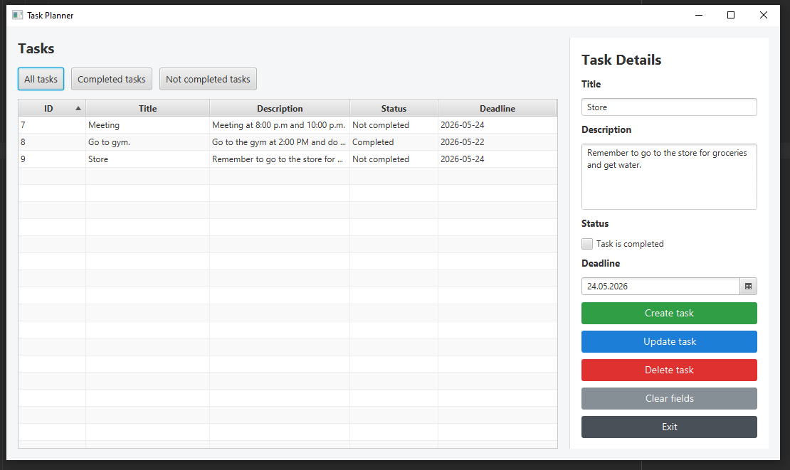
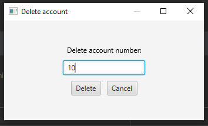

# JavaFX Task Planner

A desktop task management application built with JavaFX and MySQL for learning GUI development, database integration, and application architecture in Java.

The project demonstrates task creation, updating, deletion, filtering, and interaction with a SQL database through a clean graphical interface.

---

# Task System

## Main Interface

  
  

  Main window | delete window

---

# Features

## Task Management
- Create tasks
- Update existing tasks
- Delete tasks
- Clear input fields
- View all tasks in a TableView

## Task Information
Each task contains:
- ID
- Title
- Description
- Completion status
- Deadline date

## Filtering System
- View all tasks
- View completed tasks
- View not completed tasks

## Validation & Alerts
- Input validation
- Error handling
- Success and warning alerts

## Database Integration
- MySQL database connection
- JDBC usage
- SQL CRUD operations
- Dynamic task loading from database

---

# Technologies Used

- Java
- JavaFX
- MySQL
- JDBC

---

# What I Practiced

- JavaFX GUI development
- TableView and UI components
- Event handling
- Object-oriented programming
- Working with SQL databases
- CRUD operations
- Application structure separation
- User input validation

---

# Future Improvements

- Search system
- Task categories
- Dark mode
- Authentication system
- Better UI/UX design
- Notifications and reminders

---

# Purpose

This project was created for educational purposes and JavaFX practice while learning how desktop applications interact with databases and graphical interfaces.
